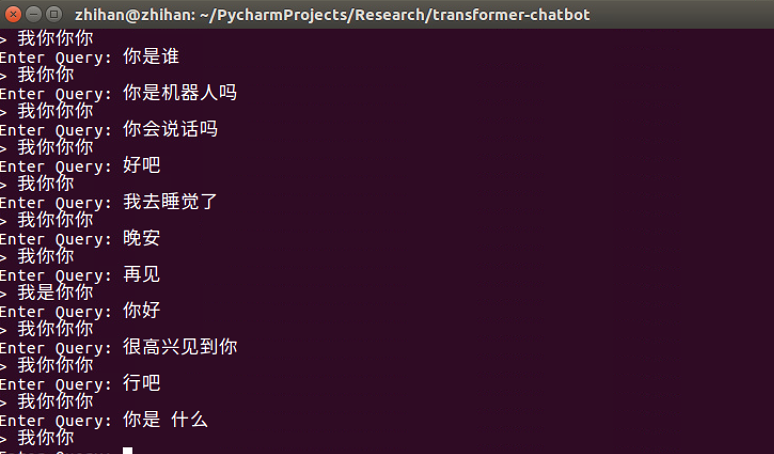
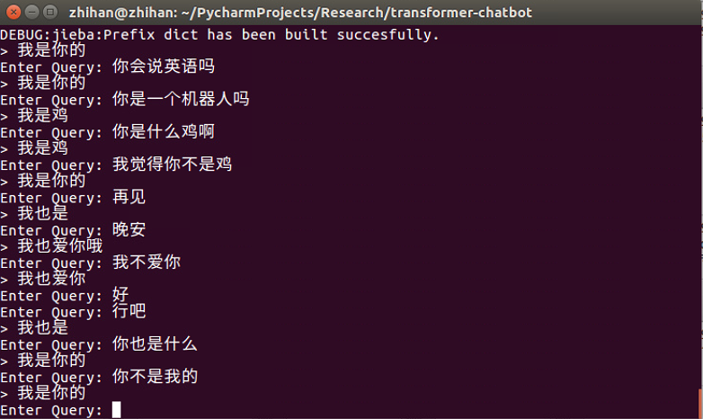

# transformer-chatbot (中文聊天机器人)

## Requirements

GPU with memory more than 8Gbs. (Decrease the batch size in both **Params.py** and **Hyperparams.py** if your memory is not enough ) 

Python == 3.x

tensorflow == 1.12.0 

tqdm = 4.28.1

numpy >= 1.15.0

jieba == 0.39

You may meet some question if your packages are in other version.


## 1. Overview

This is my tensorflow implementation of a transformer-based seq2seq chatbot (chitchat system). It now supports Chinese only, but it is pretty easy to adjust it for other language. I will update English version soon.

The implementation of transformer is cloned from [kyubyong](https://github.com/kyubyong/transformer)


There are 8 python files in total:
1. **Chat.py** is the file using to chat with trained model
2. **Data_process.py** consists of functions that generate dataset and vocabulary from raw data, and data generators that
generate data in some specific format to feed data to the tensorflow frame work
3. **Hyperparams.py** contains all the hyperparams of this model, for example, batch size and learning rate. You may change it based on your own idea.
4. **Params.py** contains the exactly same content as Hyperparams.py but with another format. This is used for debugging in python console. It is very important that whatever change you made to Hyperparams.py, do the same thing to this file.
5. **Model.py** contains the transformer model and how to train and infer the model.
6. **Modules.py** includes several modules used to construct the transformer model. For example, 
computation of multi-head attention and normalization.
7. **Train.py** defines how to train you chatbot based on training data from scrach or from pre-trained model.
8. **utils.py** contains several useful function.

## 2. Train the model
To train a model using the data(including sentence pairs and vocabulary) I uploaded, is very easy. Run:

```
python Train.py
```


In my Chinese implementation, I utilized a very popular used Chinese conversational corpus: **xiaohuangji50wnofenci.conv**, which consists of over 0.4 million one-turn conversational pairs. And use **jieba** package to spilt sentence into words.


To train a model using your own data, you need to do two more things:

1. Replace the *generate_dataset()* function in **Data_process.py** with your own function to generate two list of Strings, named sources and targets, respectively. Sources should includes all the query sentence and targets should contain all the corresponding responses.
2. Generate your own vocabulary using the *generate_vocab()* function in **Data_process.py** based on sources and targets. You may determine the number of words in your vocabulary by editing the input of this function. But don't forget to change the vocab_size term in both **Params.py** and **Hyperparams.py**

## 3. Chat with you pretrained chatbot

You model would be stored in ./model after every epoch. If you are only interested in the final version, change the **max_to_keep** parameter in **tf.train.Saver** function in **Train.py** to be 1.


Once the model is pretrained and stored in ./model, you could chat with your bot by run:

```
python Chat.py
```

Directly type  "control + c" to finish the chat. 


## 4. Demo

I trained this model for 90 epochs, I save the model after every epoch. Here are some demos of the evolution of my model.

After 1 epoch:



After 20 epochs:

 

After 90 epochs:


